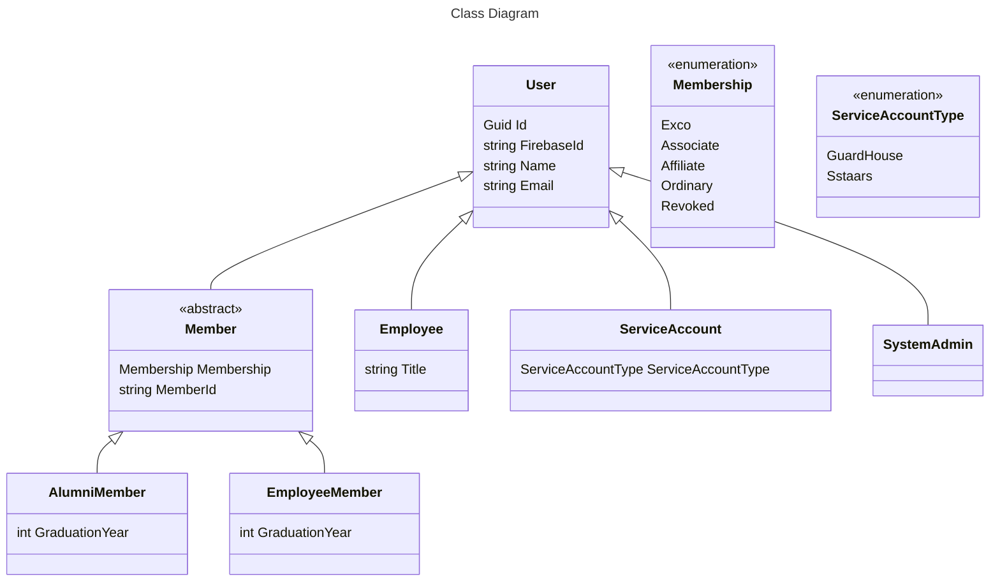

# User model

- Feature Name: `user-model`
- Start Date: 2024-02-18
- RFC PR: [sstalumniassociation/rfcs#3](https://github.com/rust-lang/rfcs/pull/3)

## Summary

This RFC proposes a new user model that can handle all current use cases, models the current membership system accurately, and introduces more flexibility for future use cases.

## Motivation

The SSTAA App Platform has gotten many feature requests, such as check-ins, event management, and even facility booking. In its current state, the user model is not a proper representation of the use cases that SSTAA needs to handle, and was designed only to support the membership tracking use case.

This led to workarounds and hacks to get the job done. In SSTAARS and Homecoming 2024, every user which registered for the event was assigned an `Ordinary` membership type, which is completely inaccurate. This is because the user model expected every user to be a member of SSTAA, which is not the case for events.

Furthermore, to access the admin interface, a user must have an `Exco` role, which meant the SSTAA App Platform team had to masquerade as Exco members of SSTAA to manage and faciliate events.

When checking people in, because the API required authentication, the SSTAARs iPad companion app had to hard code credentials in order to act as a "service account" to gain access to the API.

These are some of the current limitations experienced by the current model. More limitations could come up in the future as more features are added, such as the Guard House app.

## Detailed design

In this new user model, two entities are created for user and member. All SSTAA members are users, but users may not be SSTAA members.

It also introduces various other user types aside from the membership system, such as `Employee`, `ServiceAccount`, and `SystemAdmin`.

All user variations are subclasses of the `User` class.

The new user model adds the following new classes:

- Member
  - Abstract class
- AlumniMember
  - An SSTAA member who studied in SST
- EmployeeMember
  - An SSTAA member who has previously worked in SST, is working in SST, or previously studied in SST and is now working in SST
- Employee
  - An employee of SST who is not an SSTAA member
- ServiceAccount
  - A service account used by SSTAARs or the Guard House app
- SystemAdmin
  - Root

In the case of `AlumniMember` and `EmployeeMember`, although they both contain the same properties, they need to fulfill different requirements. For example, `EmployeeMember` is restricted to the Associate membership type.

Implemented code is available ata<https://github.com/sstalumniassociation/api/tree/feat/users/Api/Entities>.

## Drawbacks

- It is a breaking change and non-backwards compatible. This means it will require downstream updates to all SSTAA apps, including the SSTAARs iPad companion app.
- Although it allowes greater flexibility in the use cases that SSTAA can handle, it also increases the complexity of the platform. I would argue that the complexity is a necessary evil in this specific case.

## Alternatives

No alternatives were considered yet.

## Adoption strategy

This will be adopted as part of the new v1 API rollout. SDKs will be provided which support both gRPC and REST.

Since this change is not backwards compatible, it will require updates.

## Unresolved questions

- Have not fully thought through the fields required for the various users, ond the other information that should be stored.
- How will this integrate with events / bookings in the future? Since they are currently available at the user model, it means a service account could technically make a booking. Should the relationship be changed?
