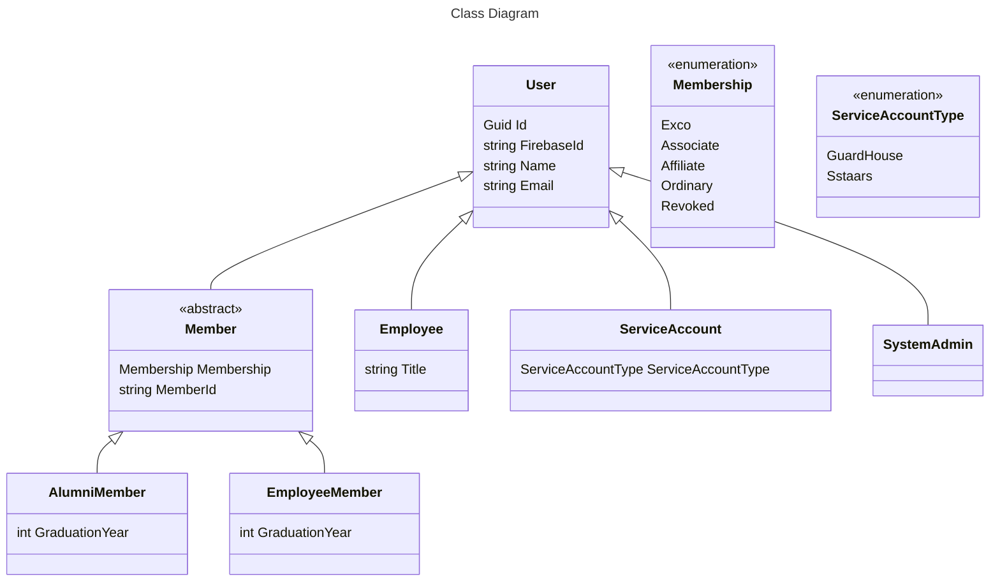

# Template

- Feature Name: (fill me in with a unique ident, `my-awesome-feature`)
- Start Date: (fill me in with today's date, YYYY-MM-DD)
- RFC PR: [sstalumniassociation/rfcs#0000](https://github.com/rust-lang/rfcs/pull/0000)

## Summary

This RFC proposes a new user model that can handle all current use cases, models the current membership system accurately, and introduces more flexibility for future use cases.

## Motivation

Why are we doing this? What use cases does it support? What is the expected
outcome?

Please focus on explaining the motivation so that if this RFC is not accepted,
the motivation could be used to develop alternative solutions. In other words,
enumerate the constraints you are trying to solve without coupling them too
closely to the solution you have in mind.

The SSTAA App Platform has gotten many feature requests, such as check-ins, event management, and even facility booking. In its current state, the user model is not a proper representation of the use cases that SSTAA needs to handle, and was designed only to support the membership tracking use case.

This led to workarounds and hacks to get the job done. In SSTAARS and Homecoming 2024, every user which registered for the event was assigned an `Ordinary` membership type, which is completely inaccurate. This is because the user model expected every user to be a member of SSTAA, which is not the case for events.

Furthermore, to access the admin interface, a user must have an `Exco` role, which meant the SSTAA App Platform team had to masquerade as Exco members of SSTAA to manage and faciliate events.

When checking people in, because the API required authentication, the SSTAARs iPad companion app had to hard code credentials in order to act as a "service account" to gain access to the API.

These are some of the current limitations experienced by the current model. More limitations could come up in the future as more features are added, such as the Guard House app.

## Detailed design

This is the bulk of the RFC. Explain the design in enough detail for somebody
familiar with React to understand, and for somebody familiar with the
implementation to implement. This should get into specifics and corner-cases,
and include examples of how the feature is used. Any new terminology should be
defined here.

## Drawbacks

Why should we *not* do this? Please consider:

- implementation cost, both in term of code size and complexity
- whether the proposed feature can be implemented in user space
- the impact on teaching people React
- integration of this feature with other existing and planned features
- cost of migrating existing React applications (is it a breaking change?)

There are tradeoffs to choosing any path. Attempt to identify them here.

## Alternatives

What other designs have been considered? What is the impact of not doing this?

## Adoption strategy

If we implement this proposal, how will existing React developers adopt it? Is
this a breaking change? Can we write a codemod? Should we coordinate with
other projects or libraries?

## How we teach this

What names and terminology work best for these concepts and why? How is this
idea best presented? As a continuation of existing React patterns?

Would the acceptance of this proposal mean the React documentation must be
re-organized or altered? Does it change how React is taught to new developers
at any level?

How should this feature be taught to existing React developers?

## Unresolved questions

Optional, but suggested for first drafts. What parts of the design are still
TBD?
